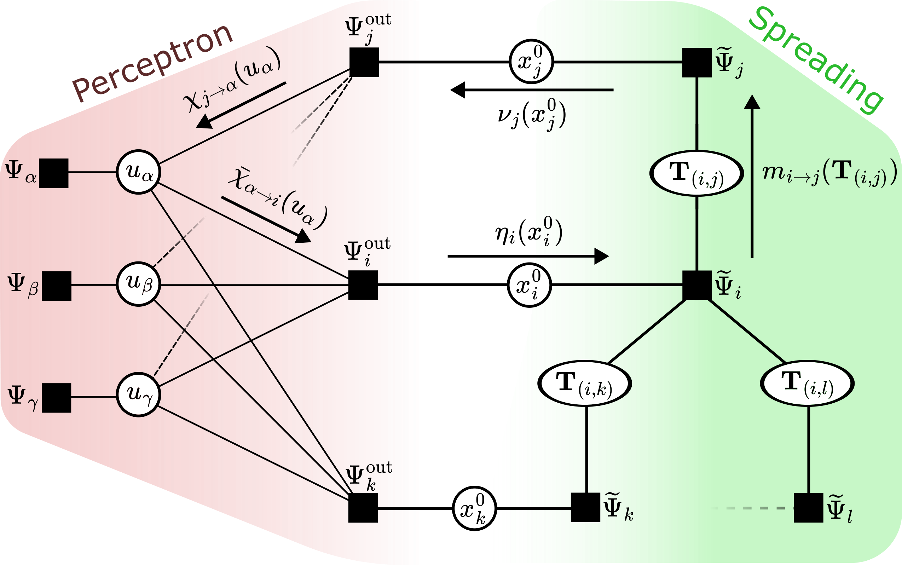

# NeuralSpreadingInference
Repository contaning the notebooks and codes to reproduce the results presented in the paper: "Inference in Spreading Processes with Neural-Network Priors"

  

## Python
To be able to reproduce the simulations, it is required to have Python 3 installed with the following packages:
- numpy
- pandas
- matplotlib
- seaborn
- scipy

## BPEpI
To be able to reproduce the simulations, it is required to install the BPEpI package (see the [BPEpI](https://github.com/ocadni/bpepi) repo).

### Analysis
Inside the folder *Analysis* we put the Python code necessary to reproduce our simulations

### Figures
The folder *Figures* contains all the Jupyter notebooks necessary to reproduce the Figures in the paper, given the data

### Data
The folder *Data* contains all the data frames, compressed in .xz format, which are needed to run the notebooks in the folder Figures

### Plots 
The folder *Plots* contains all the plots of the paper, obtained directly from the notebooks present in the folder Figures.
